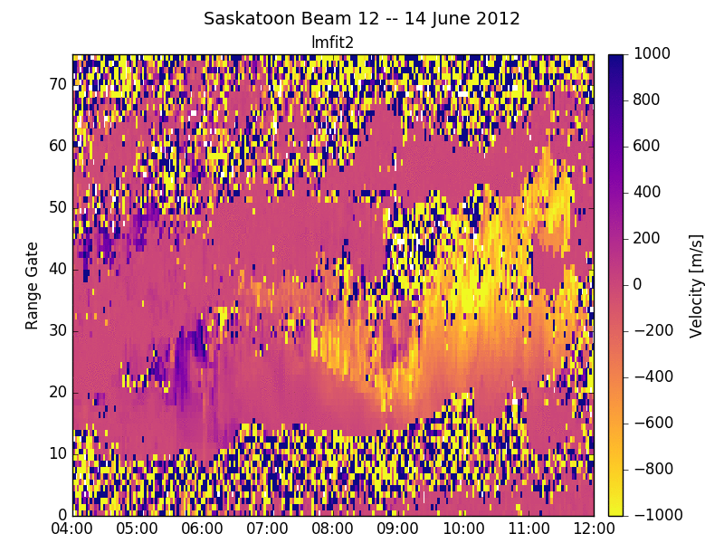

## Levenburg-Marquardt fitting of SuperDARN auto-correlation functions (ACFs). **With NO ad hoc assumptions/conditions!**
[As described by Reimer et. al. (2018)](https://doi.org/10.1002/2017RS006450).

Fitted SuperDARN data with accurate error bars. Filter data based on fitted error:

Pictured above is 8 hours of fitted velocity data for the Saskatoon SuperDARN radar for none, 800 m/s, 400 m/s, 200 m/s, 100 m/s, and 50 m/s velocity error thresholds.

# Documentation
More detailed documentation, including usage examples, is availabe on readthedocs.

# Summary
This repository contains code to that can fit the SuperDARN rawacf files using an error weighted non-linear least-squares fitting algorithm called the First-Principles Fitting Methodology (FPFM). The details of this algorithm as described in [Reimer et. al. (2018)](https://doi.org/10.1002/2017RS006450). The real and imaginary components are fitted against a decaying complex sinusoidal model of the ACF. The Levenburg-Marquardt technique is used to minimize the chi-squared sum. No ad hoc conditions are utilized. The errors in the real and imaginary components of the ACF lag estimates are based on the work by [Reimer et. al. (2016)](https://doi.org/10.1002/2016RS005975). Self-clutter due to the multiple-pulse technique is accounted for using the Mean Power-based Self-clutter Estimator (MPSE) detailed in [Reimer and Hussey (2015)](https://doi.org/10.1002/2015RS005706).

# C Code
The C code builds against [RST](https://github.com/superdarn/rst), specifically depending on the C dmap library and the hdw.dat files. For both this software and RSTLite you will need to have zlib-dev installed. It also utilizes the [cmpfit library](https://www.physics.wisc.edu/~craigm/idl/cmpfit.html) written by Craig B. Marquardt. The codebase has been structured in the same way as the [fitacf3.0 code](https://github.com/SuperDARNCanada/fitacf.3.0) written by Keith Kotyk.

Once the RSTLite and zlib dependencies are installed, to compile the `LMFIT2` code, simply change into the C code directory and use the make command. The compiled binary will be in the bin directory.

## Sourcing RST .profile.bash
Remember to source the .profile.bash file in the RST directory. If you do not, `LMFIT2` will not work

## RST dependency
The C version of `LMFIT2` specifically relies on RST these components: `fitblk.h`,`fitdata.h`,`rtypes.h`,`dmap.h`,`rprm.h`,`radar.h`, and `rawdata.h`.

# Python Code
The python version of `LMFIT2` requires the numpy and lmfit python packages to be installed. The code also relies on the python version of the dmap library [(pydmap written by Keith Kotyk)](https://github.com/SuperDARNCanada/pydmap), which is included in this repository.

# Limitations and TO DO
Currently, this code only fits the ACF not the XCF, so no elevation angles are fit for yet. Also, only the exponential model of the ACF is fit. A version of the code that fits both gaussian and exponential and ACF and XCF is under development.

# Speed
The C code takes approximately 9.5 minutes for 1 hour worth of raw data. Python hasn't yet been speed tested. The C code could be sped up by using an analytic Jacobian matrix instead of relying on MPFIT to numerically estimate it.

